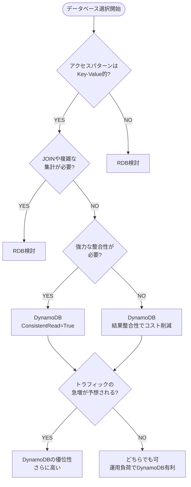

## 事象

AWS Lambda にて DynamoDB を利用する処理に失敗。普段は正しく動いていた。コードやデータに変更を加えずとも、再実行時は正常に処理が終了した。

```python
def lambda_handler(event, context):
    delete_item()
    put_item()
    scan_item() # ここでエラー発生
```

```text
Traceback (most recent call last):
  File "/tmp/exec_project_1069808669/code/main.py", line XX, in <module>
    scan_item()
  File "/tmp/exec_project_1069808669/code/main.py", line XX, in scan_item
    attr = item['key']
           ~~~~^^^^^^^
TypeError: list indices must be integers or slices, not str
```

## 原因

DynamoDB は結果整合性のある読み込みがデフォルトであり、削除・書き込みをした直後に同アイテムをスキャンしたことにより最新の項目が反映されていないデータを読み込んだ。

結果として辞書型のデータを期待するコードに空のリストが渡されエラーとなった。

## 結果整合性のある読み込み

DynamoDB では必ず最新のデータが読み込まれるわけではないということ。

> 結果整合性のある読み込みは、すべての読み取りオペレーションのデフォルトの読み込み整合性モデルです。DynamoDB テーブルまたはインデックスに対して結果整合性のある読み込みを発行すると、最近完了した書き込みオペレーションの結果が応答に反映されない場合があります。少し時間が経ってから読み取りリクエストを繰り返すと、最終的に、より最新の項目が応答で返されるはずです。

https://docs.aws.amazon.com/ja_jp/amazondynamodb/latest/developerguide/HowItWorks.ReadConsistency.html

## 対策

**必要に応じて、強力な整合性のある読み込みを使用する**こと。

:::message
強力な整合性のある読み込みは、結果整合性のある読み込みと比べて倍のコストがかかる。
:::

```python
dynamodb = boto3.resource('dynamodb')
table = dynamodb.Table('Users')

response = table.scan(
    FilterExpression=Attr('age').gte(25),
    ConsistentRead=True
)
```

## RDB vs DynamoDB

データを扱うアーキテクチャーの観点を整理した。

| 観点             | RDB（Aurora, RDS）     | DynamoDB                       |
| ---------------- | ---------------------- | ------------------------------ |
| データ構造       | 明確なスキーマ・関係型 | スキーマレス・柔軟             |
| クエリ           | 複雑な結合・集計に強い | キーアクセス中心・シンプル     |
| スケーラビリティ | 垂直スケール中心       | 水平スケール容易               |
| 一貫性           | 強整合性               | 最終整合性（強整合も選択可）   |
| コストモデル     | 常時稼働課金           | アクセス課金（オンデマンド可） |
| 運用             | 管理・調整が必要       | 完全マネージド                 |

| 代表的なユースケース                      | 推奨データストア       |
| ----------------------------------------- | ---------------------- |
| ECサイトの注文管理、在庫管理              | **RDB（Aurora, RDS）** |
| IoTデバイスのメトリクス、ログ、センサー値 | **DynamoDB**           |
| Webアプリのセッション・ユーザーキャッシュ | **DynamoDB**           |
| 会計・財務データの保存                    | **RDB**                |
| 高速なランキング・リアルタイム集計        | **DynamoDB**           |


