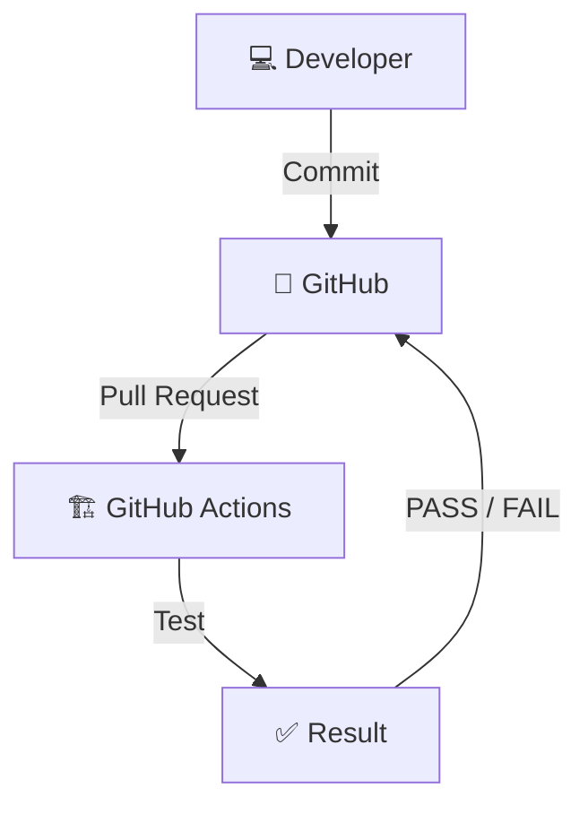

## はじめに

GitHub Actions の入門編として、プルリクエストに反応して自動テストを行うワークフローを作成してみます！

## 想定ユースケース

今回は Go を使ってニュートン法で平方根を計算するプログラムと、そのテストを実装します。

master ブランチへのプルリクエストについて、レビュアーはテストに合格しているかを確認したいです。

この処理を自動化してくれるワークフローを作成します。



## 必要な作業

1. コードとテストを作成
1. ワークフローを `${任意の名前}.yml` として作成
1. ファイルを `.github/workflows/` に配置

たったこれだけで実装できます。簡単ですね！

## ディレクトリ構成例

標準的な構成に従っています。

```text
├── .github
│   └── workflows
│       └── go-test.yml
├── README.md
├── go.mod
├── main.go
└── sqrt
    ├── sqrt.go
    └── sqrt_test.go
```

:::details sqrt.go

```go:sqrt.go
package sqrt

import (
  "math"
)

// 平方根を返す関数
func Sqrt(x float64) float64 {

  // 負の数の場合はNaNを返す
  if x < 0 {
    return math.NaN()
  }

  // ニュートン法で近似値計算
  z := 1.0
  for i := 0; i < 100; i++ {
    z -= (z*z - x) / (2 * z)
  }

  return z

}
```

:::

:::details sqrt_test.go

```go:sqrt_test.go
package sqrt_test

import (
  "example/sqrt" // ${module_name}/${package_name}でインポート
  "fmt"
  "math"
  "testing"
)

func TestSqrt(t *testing.T) {
  testCases := []struct {
    input    float64
    expected float64
    epsilon  float64
  }{
    // テストケース一覧
    {4, 2, 1e-8},
    {2, math.Sqrt2, 1e-8},
    {0, 0, 1e-8},
    {100, 10, 1e-8},
    {-1, math.NaN(), 0},
  }

  for _, tc := range testCases {
    t.Run(fmt.Sprintf("Sqrt(%v)", tc.input), func(t *testing.T) {
      result := sqrt.Sqrt(tc.input) // 平方根を計算
      if tc.input < 0 {             // 引数が負の場合、NaNを返すか
        if !math.IsNaN(result) {
          t.Errorf("Sqrt(%v) = %v, want NaN", tc.input, result)
        }
      } else if math.Abs(result-tc.expected) > tc.epsilon { // 引数が正の場合、誤差が1e-8以下になっているか
        t.Errorf("Sqrt(%v) = %v, want %v (within %v)", tc.input, result, tc.expected, tc.epsilon)
      }
    })
  }
}
```

:::

:::details main.go

```go:main.go
package main

import (
  "example/sqrt"
  "fmt"
)

func main() {
  fmt.Println("sqrt(2) =", sqrt.Sqrt(2))
  fmt.Println("sqrt(4) =", sqrt.Sqrt(4))
  fmt.Println("sqrt(-1) =", sqrt.Sqrt(-1))
}
```

:::

## ワークフロー例

- ブランチのチェックアウト
- Go のセットアップ
- 依存モジュールのダウンロード
- テスト実行

というステップで成り立っています。

```yml:go-test.yml
name: Go Test

on:
  pull_request:
    branches: [master]

jobs:
  test:
    name: Run Go Tests
    runs-on: ubuntu-latest

    steps:
      - name: Check out code
        uses: actions/checkout@v4

      - name: Set up Go
        uses: actions/setup-go@v5
        with:
          go-version: "1.21.3"

      - name: Get dependencies
        run: go mod download

      - name: Run tests
        run: go test -v ./...
```

## 動作確認

### テストが PASS した場合

プルリクエストで提出されたコードに問題がなければ、このような画面になります。


### テストが FAIL した場合

プルリクエストで提出されたコードのテストに失敗した場合、このような画面になります。


またワークフローが失敗した際には、メールが届くようです。


## まとめ

ワークフローの `.yml` ファイルを用意するだけで CI/CD に入門できて感動しました！

今回のように GitHub ホステッド ランナーであれば、インフラのプロビジョニング不要、さらにパブリックリポジトリで標準ランナー利用なら無料で無制限に利用可能という太っ腹。

GitHub Actions 恐るべし…！
