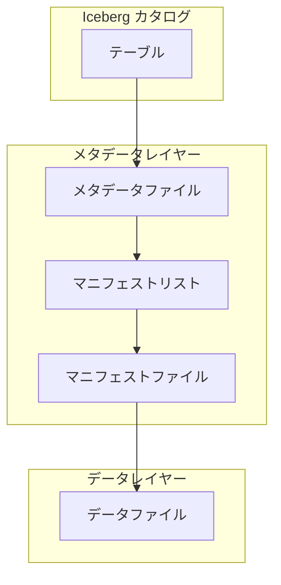

## 概要

書籍「実践 Apache Iceberg」を読み、学べることを記載します。Iceberg の仕組みや、各クエリエンジンの使い方などは書籍に譲り、本から何を学べるのかをご紹介します。

### 書籍の内容と目次紹介

https://gihyo.jp/book/2025/978-4-297-15074-7

### ハンズオン資材

https://github.com/murashitas/iceberg_book_handson

## 学べること

本書籍の内容は、大きく 3 パートに分けられます。

- Iceberg の意義・仕組み・機能（前半）
- 分散クエリエンジンからの利用方法（中盤）
- 様々なユースケースや運用例（後半）

その中で特に学びのあった項目を紹介します。

### データレイクの課題と Iceberg の役割

従来のデータレイクには以下のような課題がありました。

- 同時書き込み・読み込み時の整合性と一貫性保証の欠如
- 少量レコード更新処理の非効率性
- パーティション数の増加によるパフォーマンスの劣化
- クエリ設計にパーティションの考慮が必要
- 過去状態の復元が困難
- テーブル構造への追従が困難

Iceberg はこれら課題を解決するために生まれたテーブルフォーマットです。

| 要素                 | 具体例                                |
| -------------------- | ------------------------------------- |
| クエリエンジン       | Spark, Flink, Trino, Amazon Redshift  |
| カタログ             | Hiveメタストア, AWS Glue Data Catalog |
| テーブルフォーマット | Hive, Hudi, Iceberg, Delta Lake       |
| ファイルフォーマット | Parquet, Avro, ORC, JSON, CSV         |
| ストレージ           | HDFS, Amazon S3                       |

### Iceberg の仕組み

Iceberg テーブルは 3 層からなっています。

- Iceberg カタログ：データベースと属するテーブルを管理
- メタデータレイヤー：テーブルのスキーマ、統計情報、スナップショット履歴などを保存
- データレイヤー：テーブルのレコード情報を管理

これらの枠組みが物理的にどのような構造なのか、どうやって効率化に寄与しているのかなどは、ぜひ書籍を確認ください。

### 分散クエリエンジンからの利用方法

本書籍では以下の分散クエリエンジンから Iceberg を利用する際の使い方やクエリ例にかなりのページ数を割いています。

| クエリエンジン | 主な用途                          |
| -------------- | --------------------------------- |
| Apache Apark   | 大規模バッチ・ETL                 |
| Apache Flink   | リアルタイムストリーミング処理    |
| Trino          | インタラクティブなアドホック分析  |
| Hive           | SQL ライクな HiveQL を通じた分析  |
| PyIceberg      | Python からの軽量なアクセスや分析 |

概念や理屈はほどほどに「結局どうやって使うの？」が分からず触っていなかった方にドンピシャです。ハンズオン資材により、実行環境のセットアップ、サンプルデータの投入、長大なクエリの写経などなしに、実際の操作を体感できます。

:::message
**筆者がハンズオンを行った際のセットアップは以下の通りです。**

- WSL2 のインストール
- Docker Desktop のインストール
- WSL2 から `git clone` & `docker-compose up --build` を実行

:::

### 様々なユースケース

実際のユースケースにもとづく Iceberg の活用方法を学べます。

- Iceberg を使った ETL パイプラインの構築と、可視化までの流れのウォークスルー
- 業務システムからの変更データキャプチャ (CDC) を利用したデータの取り込みの方法
- データへの継続的な変更を追跡するための履歴管理 (SCD-Type2) の実装方法
- ブランチ機能を利用したデータ品質管理のテクニック
- 継続的に生成されるデータをリアルタイムに処理し、スキーマの進化に対応する方法

「Iceberg テーブルの作成とデータ挿入はできたけど何が嬉しいの？」「業務に活用したり提案するイメージが湧かない」といった悩みに対するひとつの回答を示してくれます。

例えば 4 番目の WAP パターンを利用した品質管理では、プロダクション環境にコネクティッドカーの異常なテレメトリ（極端に高い加速度や、GPS 情報の欠損など）が混入しないように制御するなど、具体的な例で多くの応用ユースケースを思いつかせてくれます。

### パフォーマンス最適化

パフォーマンス最適化の種類と手法が学べます。大規模なデータ利活用に取り組んだ経験がなければどこに落とし穴があるか勘が働かないため、事前に知っておくことができるのは強力です。

パフォーマンス低下の原因とそれへの対策方針が整理されており、トラブルシュート時の勘所を育むことができます。

|                    | クエリパフォーマンス                                                                                                 | 書き込みパフォーマンス                                                           |
| ------------------ | -------------------------------------------------------------------------------------------------------------------- | -------------------------------------------------------------------------------- |
| 基本的な最適化手法 | データファイルサイズの調整、パーティショニング、バケッティング、ソートカラムの指定、コンパクションの実行とソート戦略 | 書き込みパスの分散、書き込みモードの選択、書き込みトランザクションの競合への対処 |
| 高度な最適化手法   | ブルームフィルタの利用、カラム統計値の利用、NDV 推定値の利用                                                         | 書き込み分散モードの設定、Spark ファンアウトライターの利用                       |

### 移行戦略とパターン

既存のデータ基盤を Iceberg に移行する際に必要なステップとその検討事項について記載があります。技術面ばかりに目がいきがちな私としては、移行の対象選定や効果測定のためにも目的を明文化するというのが身に染みました。

- Iceberg の導入目的の確認
- 移行対象の整理
- 移行戦略の計画と実行

また移行アプローチとして 3 つのシナリオが検討されており、リライト・リプレースの選択、新旧基盤の並行稼働、コンシューマーや ETL ジョブなどのコンポーネントごとの切り替えなどのアイデアを提供してくれます。

- 小規模なテーブルで複雑な要件がない場合
- 中規模以上のテーブルで新旧テーブルの並行運用が必要な場合
- 大規模テーブルで書き込み処理を止められない場合

## 本書籍ではフォローしないこと

データベース全般に関わるような話題については、詳細に書かれているわけではありません。

- RDBMS で実装してはダメなのか？何が違うのか？
- 分散クエリエンジンはなぜこんなにあるのか？使い分けは？
- 列指向ファイルフォーマットとは？なぜビックデータに強いのか？

こうした疑問は ChatGPT や Claude などに聞くと綺麗にまとめて教えてくれるので、自分で調べてみましょう。

## 誰が読むべきか

以下のような人におすすめです！

- データレイクやデータウェアハウスに興味があるが、触れる機会がない人
- 環境構築や SQL に詰まってしまい、実機の操作を諦めた人
- データ基盤の構築提案や、パフォーマンス改善などに取り組みたい人
