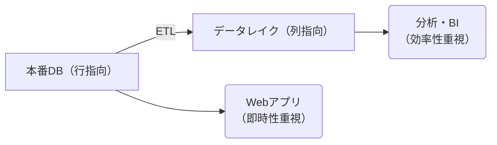

## ファイルフォーマット

データレイクにおいて列指向のファイルフォーマット (Parquet) が高速であるため用いられると聞いたので、その理由を調べた。

### 行指向

行指向フォーマットでは、データを行単位で連続して格納する。

```text
[ID:1, Name:"Taro", Age:25, Salary:3,000,000]
[ID:2, Name:"Hanako", Age:30, Salary:4,000,000]
[ID:3, Name:"Jiro", Age:30, Salary:4,000,000]
... 
```

行指向のファイルフォーマットの代表例は以下。

- CSV
- JSON
- Avro

### 列指向

列指向フォーマットでは、データを列単位で連続して格納する。

```text
[ID: 1, 2, 3, ...]
[Name: "Taro", "Hanako", "Jiro", ...]
[Age: 25, 30, 28, ...]
[Salary: 3,000,000, 4,000,000, 3,000,000, ...]
```

列指向のファイルフォーマットの代表例は以下。

- Parquet
- ORC

## なぜ列指向が高速なのか？

重要な点は **各列においてデータ型が統一されている** ということ。

### 必要な列だけ読み込める

例えば「全従業員の平均年齢を計算する」というクエリの場合

- CSV(行指向): すべての列(ID、Name、Age、Salary)を読み込む必要がある
- Parquet(列指向): Age 列だけを読み込めばよい

100 列あるテーブルで 1 列だけ必要な場合、理論上は読み込むデータ量が 1 / 100。

### 圧縮効率がよい

同じデータ型が連続して並ぶため、圧縮が効果的。

年齢列: [25, 25, 25, 26, 26, 27, ...] → 同じ値が連続するため高圧縮
文字列列: ["営業部", "営業部", "技術部", ...] → 辞書エンコーディングで効率化

CSV では各行に異なる型のデータが混在するため、このような最適化ができない。

### CPU に最適化されている

同じ型のデータが連続して配置されているため、CPU の処理において有利。

- CPU のベクトル演算 (SIMD) を活用できる
- メモリアクセスパターンが予測しやすい
- キャッシュヒット率が向上

## では全部列指向のフォーマットにすればよいのでは？

列指向フォーマットには重要なトレードオフがあり、すべてのユースケースに適しているわけではない。

### 行単位のアクセスが遅い

ユーザー情報を 1 件取得する場合

- CSV(行指向):
  - 1 行読めば完了
- Parquet(列指向):
  - ID 列から該当行を探す
  - Name 列から該当位置を読む
  - Age 列から該当位置を読む
  - Salary 列から該当位置を読む

Webアプリケーションで「ユーザーID = 123の情報を表示」のような操作は頻繁するが、列指向では非効率。

### 更新が複雑

データを追加する場合

- CSV(行指向):
  - 新しい行を末尾に追加するだけ
- Parquet(列指向):
  - すべての列ファイルを開く
  - 各列に値を追加

さらに 1 行だけ更新する場合、列指向では複数の列ファイルを書き換える必要があり、トランザクション処理が複雑。

### 小データで非効率

列指向フォーマットは

- 各列ごとにメタデータが必要
- 圧縮・エンコーディングの情報
- 統計情報(最小値、最大値など)

数百行程度の小さなデータでは、このメタデータのオーバーヘッドで逆に非効率。

### 実装が複雑

トランザクションシステム（ECサイト、銀行システムなど）では

- 注文を即座に記録したい
- 在庫を即座に更新したい
- 1 件ずつの読み書きが主体

列指向の複雑な構造は、このような用途には向かない。

## よくあるアーキテクチャ

行指向と列指向ではトレードオフがあるため、実システムでは 2 つを用いたハイブリット構成が主流。



## エンコーディングについて

Parquet は自動的に各列をエンコーディングしてくれるので、効率がよくなる。

- 各列のカーディナリティ（ユニーク値の数）を分析
- カーディナリティが低い列に自動で辞書エンコーディング適用
- データ型に応じて最適なエンコーディングを選択

例えば以下の通り。

- 部署名（10種類程度） → 辞書エンコーディング
- メールアドレス（ほぼ全てユニーク） → 辞書化しない
- 日付（限られた範囲） → Delta encoding
- 金額（連続値） → Bit-packing

### 辞書エンコーディング

文字列を圧縮する方法。

```text
営業部
営業部
営業部
人事部
技術部
... (以下繰り返し)

**辞書エンコーディング適用後**

【辞書】
0 → "営業部"
1 → "技術部"
2 → "人事部"

【実データ】
0, 0, 0, 2, 1, ...

【さらにランレングス符号化】
0*3, 2, 1, ...

**圧縮前**
- "営業部" = 9 バイト(UTF-8 で 3 文字 × 3 バイト)
- 100 万行 × 9 バイト = 9 MB

**圧縮後**
- 辞書: 3 種類 × 9 バイト = 27 バイト
- ID 配列: 100 万行 × 1 バイト* = 1 MB
- 合計 ≈ 1 MB (約 9 分の 1 に圧縮)
```

文字列比較より数値比較のほうが高速、数値のほうがメモリ消費量も下がる、などの利点も。

### Delta Encoding

日付を圧縮する方法。

```text
日付は連続的に増加することが多い:

【元データ】
2024-01-01 (エポック秒: 1704067200)
2024-01-02 (エポック秒: 1704153600)
2024-01-03 (エポック秒: 1704240000)

【Delta Encoding】
基準値: 1704067200
差分: 0, +86400, +86400, +86400, ...

【さらに圧縮】
差分が一定 (86400) なのでランレングス符号化
→ "86400*3"

数GB → 数百バイトになることも。
```

### Bit-packing

整数値を圧縮する方法。

```text
基準値: 100
差分: 0, 5, 10, 15, 20 (各 5 bit)

32 bit × 5 個 = 160 bit
↓
32bit(基準値) + 5 bit × 5 個 = 57 bit
→ 約 64 % 圧縮
```

## 感想

データやワークロードの特性をうまく利用したファイルフォーマットであることがわかった。特にエンコーディングは賢いなと思った。
