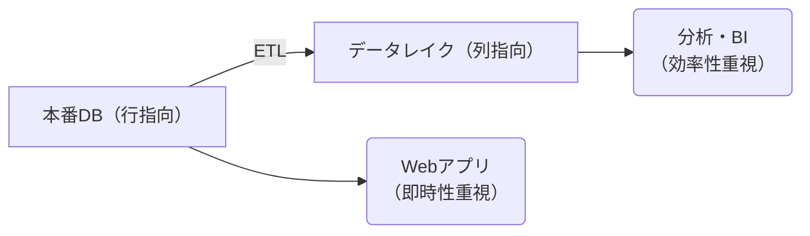

## ファイルフォーマット

データレイクにおいて列指向のファイルフォーマットが高速であるため用いられれると聞いたので、その理由を調べた。

### 行指向

行指向フォーマットでは、データを行単位で連続して格納する。

```text
[ID:1, Name:"Taro", Age:25, Salary:3,000,000]
[ID:2, Name:"Hanako", Age:30, Salary:4,000,000]
[ID:3, Name:"Jiro", Age:30, Salary:4,000,000]
... 
```

行指向のファイルフォーマットの代表例は以下。

- CSV
- JSON
- Avro

### 列指向

列指向フォーマットでは、データを列単位で連続して格納する。

```text
[ID: 1, 2, 3, ...]
[Name: "Taro", "Hanako", "Jiro", ...]
[Age: 25, 30, 28, ...]
[Salary: 3,000,000, 4,000,000, 3,000,000, ...]
```

列指向のファイルフォーマットの代表例は以下。

- Parquet
- ORC

## なぜ列指向が高速なのか？

重要な点は **各列においてデータ型が統一されている** ということ。

### 必要な列だけ読み込める

例えば「全従業員の平均年齢を計算する」というクエリの場合

- CSV(行指向): すべての列(ID、Name、Age、Salary)を読み込む必要がある
- Parquet(列指向): Age列だけを読み込めばよい

100 列あるテーブルで 1 列だけ必要な場合、理論上は読み込むデータ量が 1 / 100。

### 圧縮効率がよい

同じデータ型が連続して並ぶため、圧縮が効果的。

年齢列: [25, 25, 25, 26, 26, 27, ...] → 同じ値が連続するため高圧縮
文字列列: ["営業部", "営業部", "技術部", ...] → 辞書エンコーディングで効率化

CSVでは各行に異なる型のデータが混在するため、このような最適化ができない。

### CPU に最適化されている

同じ型のデータが連続して配置されているため、CPU の処理において有利。

- CPUのベクトル演算(SIMD)を活用できる
- メモリアクセスパターンが予測しやすい
- キャッシュヒット率が向上

## では全部列指向のフォーマットにすればよいのでは？

列指向フォーマットには重要なトレードオフがあり、すべてのユースケースに適しているわけではない。

### 行単位のアクセスが遅い

ユーザー情報を1件取得する場合

- CSV(行指向):
  - 1行読めば完了
- Parquet(列指向):
  - ID列から該当行を探す
  - Name列から該当位置を読む
  - Age列から該当位置を読む
  - Salary列から該当位置を読む

Webアプリケーションで「ユーザーID = 123の情報を表示」のような操作は頻繁するが、列指向では非効率。

### 更新が複雑

データを追加する場合

- CSV(行指向):
  - 新しい行を末尾に追加するだけ
- Parquet(列指向):
  - すべての列ファイルを開く
  - 各列に値を追加

さらに 1 行だけ更新する場合、列指向では複数の列ファイルを書き換える必要があり、トランザクション処理が複雑。

### 小データで非効率

列指向フォーマットは

- 各列ごとにメタデータが必要
- 圧縮・エンコーディングの情報
- 統計情報(最小値、最大値など)

数百行程度の小さなデータでは、このメタデータのオーバーヘッドで逆に非効率。

### 実装が複雑

トランザクションシステム(ECサイト、銀行システムなど)では

- 注文を即座に記録したい
- 在庫を即座に更新したい
- 1件ずつの読み書きが主体

列指向の複雑な構造は、このような用途には向かない。

## よくあるアーキテクチャ

行指向と列指向ではトレードオフがあるため、実システムでは 2 つを用いたハイブリット構成が主流。


